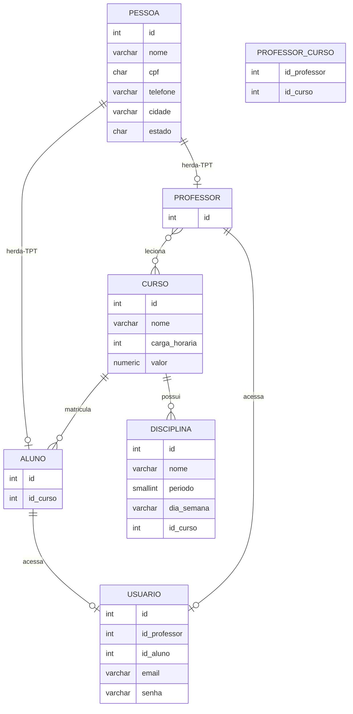

# 📊 Diagrama de Entidade e Relacionamento (ER)

**Projeto:** EinsteinGestaoAcademica  
**Banco de Dados:** PostgreSQL  
**Padrão de Herança:** TPT (Table-Per-Type)

---

## 🎯 Visão Geral do Sistema

Sistema de gestão acadêmica com controle de:
- 👥 **Pessoas** (base para Alunos e Professores)
- 🎓 **Cursos** e **Disciplinas**
- 👨‍🎓 **Alunos** (matriculados em cursos)
- 👨‍🏫 **Professores** (lecionam em cursos)
- 🔐 **Usuários** (acesso ao sistema)

---

## 🗂️ Diagrama Mermaid (Entidades e Relacionamentos)



> **Legenda:**
> - `PK` = Primary Key (chave primária)
> - `FK` = Foreign Key (chave estrangeira)
> - `UK` = Unique Key (chave única)
> - Relacionamentos: `||--o|` (1:0..1), `||--o{` (1:N), `}o--o{` (N:N)

### 🔑 Chaves e Constraints por Tabela

| Tabela | Chaves Primárias (PK) | Chaves Estrangeiras (FK) | Unique Keys (UK) |
|--------|----------------------|--------------------------|------------------|
| **PESSOA** | id | - | cpf |
| **ALUNO** | id | id → pessoa(id)<br>id_curso → curso(id) | - |
| **PROFESSOR** | id | id → pessoa(id) | - |
| **CURSO** | id | - | - |
| **DISCIPLINA** | id | id_curso → curso(id) | - |
| **PROFESSOR_CURSO** | id_professor, id_curso | id_professor → professor(id)<br>id_curso → curso(id) | - |
| **USUARIO** | id | id_professor → professor(id)<br>id_aluno → aluno(id) | email |

---

## 📋 Entidades e Atributos Detalhados

### 1. 👤 PESSOA (Tabela Base - Herança TPT)

| Atributo | Tipo | Restrições | Descrição |
|----------|------|------------|-----------|
| **id** | SERIAL | PK | Identificador único |
| **nome** | VARCHAR(150) | NOT NULL | Nome completo |
| **cpf** | CHAR(11) | NOT NULL, UNIQUE | CPF (somente números) |
| **telefone** | VARCHAR(20) | - | Telefone de contato |
| **cidade** | VARCHAR(100) | - | Cidade de residência |
| **estado** | CHAR(2) | - | UF (ex: SP, RJ) |

> **Estratégia TPT:** `PESSOA` é a tabela base. `ALUNO` e `PROFESSOR` herdam dela compartilhando o mesmo `id`.

---

### 2. 👨‍🎓 ALUNO (Herda de PESSOA)

| Atributo | Tipo | Restrições | Descrição |
|----------|------|------------|-----------|
| **id** | INT | PK, FK → pessoa(id) | Mesmo ID da pessoa |
| **id_curso** | INT | FK → curso(id), NOT NULL | Curso matriculado |

**Relacionamentos:**
- 🔗 **1:1** com PESSOA (herança TPT)
- 🔗 **N:1** com CURSO (aluno matriculado em UM curso)
- 🔗 **1:0..1** com USUARIO (pode ter conta no sistema)

---

### 3. 👨‍🏫 PROFESSOR (Herda de PESSOA)

| Atributo | Tipo | Restrições | Descrição |
|----------|------|------------|-----------|
| **id** | INT | PK, FK → pessoa(id) | Mesmo ID da pessoa |

**Relacionamentos:**
- 🔗 **1:1** com PESSOA (herança TPT)
- 🔗 **N:N** com CURSO (via tabela `professor_curso`)
- 🔗 **1:0..1** com USUARIO (pode ter conta no sistema)

---

### 4. 🎓 CURSO

| Atributo | Tipo | Restrições | Descrição |
|----------|------|------------|-----------|
| **id** | SERIAL | PK | Identificador único |
| **nome** | VARCHAR(200) | NOT NULL | Nome do curso |
| **carga_horaria** | INT | NOT NULL | Total de horas do curso |
| **valor** | NUMERIC(10,2) | NOT NULL | Mensalidade (R$) |

**Relacionamentos:**
- 🔗 **1:N** com DISCIPLINA (curso possui várias disciplinas)
- 🔗 **1:N** com ALUNO (curso tem vários alunos matriculados)
- 🔗 **N:N** com PROFESSOR (via `professor_curso`)

---

### 5. 📚 DISCIPLINA

| Atributo | Tipo | Restrições | Descrição |
|----------|------|------------|-----------|
| **id** | SERIAL | PK | Identificador único |
| **nome** | VARCHAR(200) | NOT NULL | Nome da disciplina |
| **periodo** | SMALLINT | NOT NULL, CHECK(1 ou 2) | 1=Noturno, 2=Diurno |
| **dia_semana** | VARCHAR(20) | NOT NULL | Ex: Segunda, Terça |
| **id_curso** | INT | FK → curso(id), NOT NULL | Curso que oferece |

**Relacionamentos:**
- 🔗 **N:1** com CURSO (disciplina pertence a UM curso)

**Enum Periodo:**
- `1` = Noturno
- `2` = Diurno

---

### 6. 🔄 PROFESSOR_CURSO (Tabela de Junção N:N)

| Atributo | Tipo | Restrições | Descrição |
|----------|------|------------|-----------|
| **id_professor** | INT | PK, FK → professor(id) | Professor que leciona |
| **id_curso** | INT | PK, FK → curso(id) | Curso lecionado |

**Relacionamentos:**
- 🔗 Implementa relacionamento **N:N** entre PROFESSOR e CURSO
- Um professor pode lecionar em vários cursos
- Um curso pode ter vários professores

---

### 7. 🔐 USUARIO (Acesso ao Sistema)

| Atributo | Tipo | Restrições | Descrição |
|----------|------|------------|-----------|
| **id** | SERIAL | PK | Identificador único |
| **id_professor** | INT | FK → professor(id), NULL | Vínculo com professor |
| **id_aluno** | INT | FK → aluno(id), NULL | Vínculo com aluno |
| **email** | VARCHAR(255) | NOT NULL, UNIQUE | Email de login |
| **senha** | VARCHAR(255) | NOT NULL | Hash da senha |

**Relacionamentos:**
- 🔗 **0..1:1** com PROFESSOR (usuário pode ser professor)
- 🔗 **0..1:1** com ALUNO (usuário pode ser aluno)

> **Regra:** Um usuário pode ser professor OU aluno OU nenhum dos dois (usuário administrativo).

---

## 🔗 Resumo dos Relacionamentos

| Relacionamento | Cardinalidade | Descrição |
|----------------|---------------|-----------|
| PESSOA → ALUNO | **1:0..1** | Herança TPT (um pessoa pode ser aluno) |
| PESSOA → PROFESSOR | **1:0..1** | Herança TPT (uma pessoa pode ser professor) |
| CURSO → DISCIPLINA | **1:N** | Um curso possui várias disciplinas |
| CURSO → ALUNO | **1:N** | Um curso tem vários alunos matriculados |
| ALUNO → CURSO | **N:1** | Cada aluno está em UM curso |
| PROFESSOR ↔ CURSO | **N:N** | Professores lecionam em vários cursos |
| PROFESSOR → USUARIO | **1:0..1** | Professor pode ter conta de usuário |
| ALUNO → USUARIO | **1:0..1** | Aluno pode ter conta de usuário |

---

## 🎨 Diagrama Visual ASCII

```
┌─────────────┐
│   PESSOA    │ (Base - TPT)
├─────────────┤
│ • id (PK)   │
│ • nome      │──┐
│ • cpf (UK)  │  │ Herança TPT (Table-Per-Type)
│ • telefone  │  │
│ • cidade    │  │
│ • estado    │  │
└─────────────┘  │
                 │
        ┌────────┴────────┐
        │                 │
  ┌─────▼──────┐   ┌──────▼─────┐
  │   ALUNO    │   │ PROFESSOR  │
  ├────────────┤   ├────────────┤
  │ • id (PK)  │   │ • id (PK)  │
  │ • id_curso │   └─────┬──────┘
  └─────┬──────┘         │
        │                │
        │                │ N:N (via professor_curso)
        │                │
        │         ┌──────▼──────────┐
        │         │ PROFESSOR_CURSO │
        │         ├─────────────────┤
        │         │ • id_professor  │
        │         │ • id_curso      │
        │         └──────┬──────────┘
        │                │
        │    ┌───────────┘
        │    │
   ┌────▼────▼────┐
   │    CURSO     │
   ├──────────────┤
   │ • id (PK)    │
   │ • nome       │
   │ • carga_hora │
   │ • valor      │
   └──────┬───────┘
          │
          │ 1:N
          │
   ┌──────▼───────┐
   │  DISCIPLINA  │
   ├──────────────┤
   │ • id (PK)    │
   │ • nome       │
   │ • periodo    │
   │ • dia_semana │
   │ • id_curso   │
   └──────────────┘

   ┌──────────────┐
   │   USUARIO    │ (Independente)
   ├──────────────┤
   │ • id (PK)    │
   │ • id_prof    │ ← FK (NULL)
   │ • id_aluno   │ ← FK (NULL)
   │ • email (UK) │
   │ • senha      │
   └──────────────┘
```

---

## 📝 Regras de Negócio

### ✅ Regras Implementadas via Constraints

1. **Herança TPT:**
   - Aluno e Professor compartilham o mesmo `id` da tabela Pessoa
   - `ON DELETE CASCADE`: deletar pessoa → deleta aluno/professor automaticamente

2. **Unicidade:**
   - `pessoa.cpf` deve ser único
   - `usuario.email` deve ser único

3. **Integridade Referencial:**
   - Deletar `curso` → deleta disciplinas associadas (CASCADE)
   - Deletar `professor` ou `curso` → deleta registros de `professor_curso` (CASCADE)
   - Deletar `aluno` ou `professor` → deleta usuário associado (CASCADE)

4. **Validações:**
   - `disciplina.periodo` só aceita valores 1 (Noturno) ou 2 (Diurno)
   - Todos os campos marcados como `NOT NULL` são obrigatórios

### 🔐 Regras de Usuário

- Um usuário pode ser:
  - **Professor** (`id_professor` preenchido, `id_aluno` NULL)
  - **Aluno** (`id_aluno` preenchido, `id_professor` NULL)
  - **Administrativo** (ambos NULL)
- Um usuário **NÃO pode** ser professor E aluno simultaneamente

---

## 🛠️ Tecnologias

- **Banco de Dados:** PostgreSQL
- **Estratégia de Herança:** TPT (Table-Per-Type)
- **Versionamento:** Git
- **Documentação:** Markdown + Mermaid

---

## 📚 Exemplos de Consultas

### Buscar todos os alunos de um curso específico:
```sql
SELECT p.nome, p.cpf, c.nome AS curso
FROM aluno a
INNER JOIN pessoa p ON a.id = p.id
INNER JOIN curso c ON a.id_curso = c.id
WHERE c.id = 1;
```

### Buscar todos os cursos que um professor leciona:
```sql
SELECT pr.id, p.nome AS professor, c.nome AS curso
FROM professor pr
INNER JOIN pessoa p ON pr.id = p.id
INNER JOIN professor_curso pc ON pr.id = pc.id_professor
INNER JOIN curso c ON pc.id_curso = c.id
WHERE pr.id = 10;
```

### Buscar disciplinas de um curso no período noturno:
```sql
SELECT d.nome, d.dia_semana, c.nome AS curso
FROM disciplina d
INNER JOIN curso c ON d.id_curso = c.id
WHERE c.id = 1 AND d.periodo = 1;
```

### Buscar usuário com informações completas (aluno ou professor):
```sql
SELECT 
    u.email,
    p.nome,
    CASE 
        WHEN u.id_aluno IS NOT NULL THEN 'Aluno'
        WHEN u.id_professor IS NOT NULL THEN 'Professor'
        ELSE 'Administrativo'
    END AS tipo_usuario
FROM usuario u
LEFT JOIN aluno a ON u.id_aluno = a.id
LEFT JOIN professor pr ON u.id_professor = pr.id
LEFT JOIN pessoa p ON COALESCE(a.id, pr.id) = p.id
WHERE u.id = 5;
```

---

## 📊 Estatísticas do Schema

| Métrica | Valor |
|---------|-------|
| **Tabelas** | 7 |
| **Relacionamentos** | 8 |
| **Chaves Primárias** | 7 |
| **Chaves Estrangeiras** | 8 |
| **Constraints UNIQUE** | 2 (cpf, email) |
| **Constraints CHECK** | 1 (periodo) |

---

## 🔄 Histórico de Versões

| Versão | Data | Descrição |
|--------|------|-----------|
| 1.0 | 2026-03-17 | Schema inicial com herança TPT |

---

**Desenvolvido por:** Prof. Geovani  
**Instituição:** Faculdade Einstein de Limeira  
**Disciplina:** Desenvolvimento Web Back-End  
**Projeto:** EinsteinGestaoAcademica
